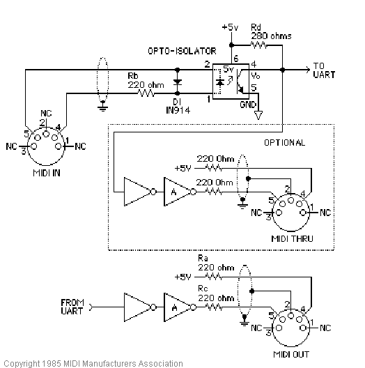

# volca fm velocity filter

## parts

- arduino (i used a pro mini because it's small and can be put in a box, they're like $2 on aliexpress)
- two 5-pin din connectors
- opto-isolator (i used a pc900 but use whatever works)
- inverter (maybe not necessary but it's in the midi specification. i used a 74hc04)
- some resistors
- midi controller
- volca fm

## how

make the above circuit and hook the midi out to tx on the arduino and the midi in to rx

flash the program to the arduino

hook the midi out on your controller to midi in on the arduino, then midi out on the arduino to the volca

witness the magic as you have velocity data transmitted

## why

1. i wanted it for myself
2. it was stupid easy to build
3. i saw a post on reddit or whatever talking about a cable that was like a million dollars and i wanted to provide a solution that costs like $10 and some elbow grease. there were also posts about doing some shit like using a vst or an ios app and that's just silly imo

## to-do
- add battery power
- maybe add power that leeches from the midi out on your controller, idk. pull requests accepted!

## who
will oberndorfer